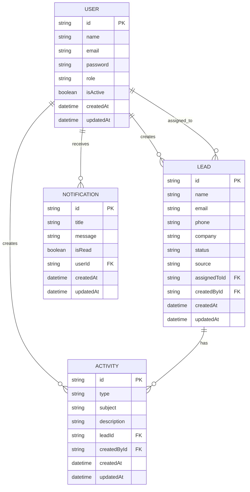

# CRM System ER Diagram

```mermaid
erDiagram
    USER ||--o{ LEAD : "creates"
    USER ||--o{ LEAD : "assigned_to"
    USER ||--o{ ACTIVITY : "creates"
    USER ||--o{ NOTIFICATION : "receives"
    LEAD ||--o{ ACTIVITY : "has"
    USER {
        string id PK
        string name
        string email
        string password
        string role
        boolean isActive
        datetime createdAt
        datetime updatedAt
    }
    LEAD {
        string id PK
        string name
        string email
        string phone
        string company
        string status
        string source
        string assignedToId FK
        string createdById FK
        datetime createdAt
        datetime updatedAt
    }
    ACTIVITY {
        string id PK
        string type
        string subject
        string description
        string leadId FK
        string createdById FK
        datetime createdAt
        datetime updatedAt
    }
    NOTIFICATION {
        string id PK
        string title
        string message
        boolean isRead
        string userId FK
        datetime createdAt
        datetime updatedAt
    }
```