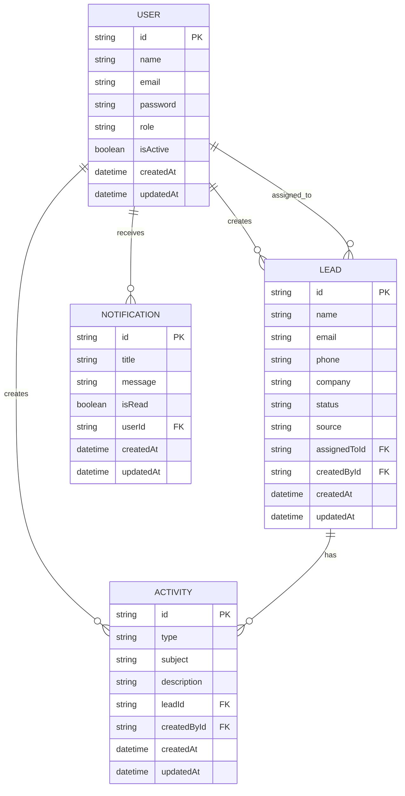

# CRM System ER Diagram (Visual)

## Entity Descriptions

### USER
- **id** (PK): Unique identifier for the user
- **name**: User's full name
- **email**: User's email address (unique)
- **password**: Hashed password
- **role**: User role (ADMIN, MANAGER, SALES_EXECUTIVE)
- **isActive**: Whether the user account is active
- **createdAt**: Timestamp when the user was created
- **updatedAt**: Timestamp when the user was last updated

### LEAD
- **id** (PK): Unique identifier for the lead
- **name**: Lead's full name
- **email**: Lead's email address
- **phone**: Lead's phone number
- **company**: Lead's company name
- **status**: Lead status (NEW, CONTACTED, QUALIFIED, LOST, CONVERTED)
- **source**: Source of the lead (e.g., Website, Referral)
- **assignedToId** (FK): Reference to the USER who is assigned to this lead
- **createdById** (FK): Reference to the USER who created this lead
- **createdAt**: Timestamp when the lead was created
- **updatedAt**: Timestamp when the lead was last updated

### ACTIVITY
- **id** (PK): Unique identifier for the activity
- **type**: Type of activity (CALL, MEETING, NOTE, EMAIL)
- **subject**: Subject or title of the activity
- **description**: Detailed description of the activity
- **leadId** (FK): Reference to the LEAD this activity is related to
- **createdById** (FK): Reference to the USER who created this activity
- **createdAt**: Timestamp when the activity was created
- **updatedAt**: Timestamp when the activity was last updated

### NOTIFICATION
- **id** (PK): Unique identifier for the notification
- **title**: Notification title
- **message**: Notification message content
- **isRead**: Whether the notification has been read
- **userId** (FK): Reference to the USER this notification is for
- **createdAt**: Timestamp when the notification was created
- **updatedAt**: Timestamp when the notification was last updated

## Relationships

1. **USER to LEAD (creates)**: One-to-Many
   - One USER can create many LEADs
   - Each LEAD has one creator (createdById)

2. **USER to LEAD (assigned_to)**: One-to-Many
   - One USER can be assigned to many LEADs
   - Each LEAD is assigned to one USER (assignedToId)

3. **USER to ACTIVITY**: One-to-Many
   - One USER can create many ACTIVITYs
   - Each ACTIVITY is created by one USER (createdById)

4. **USER to NOTIFICATION**: One-to-Many
   - One USER can receive many NOTIFICATIONs
   - Each NOTIFICATION is for one USER (userId)

5. **LEAD to ACTIVITY**: One-to-Many
   - One LEAD can have many ACTIVITYs
   - Each ACTIVITY is related to one LEAD (leadId)